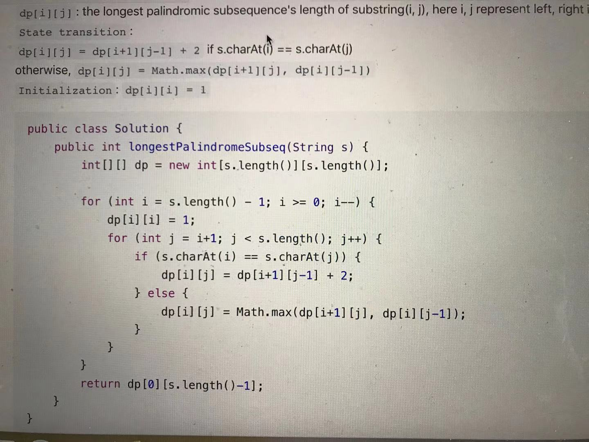

2Sum based:
- Use dict to make exact search so easy
- Variations I:
  - 2SumCls [170] w/ add & find, use what data structure? use {num:cnt} dict to still handle find in O(N); careful of same num
- Variations II:
  - 3Sum, use a helper func: find2Sum 
  - 3SumClosest (16), enumerate all I,J, binary search (BS) proper k from K
    - modified BS with final abs check (optimal index could be l, could be l-1)
    - Harder version: Closest Subsequence Sum [1755], need to add Subsets [78]
  - 3SumSmaller [259], use varied helper func on sorted array: cnt2SumSmaller
  - 4Sum: TODO

- Given an array of n integers nums and a target, find the number of index triplets i, j, k with 0 <= i < j < k < n that satisfy the condition nums[i] + nums[j] + nums[k] < target.

Details: 
- When iter i,j,k, remember range of i is len-2
- WordBreak [139], use dict (can represent 3 states: not seen/true/false) instead of set's 2 states (true/other). In this problem, need to memorize/differentiate whether it is false/not seen to avoid TLE. 

- LongestPalindromicSubstring [5]
  - Stupid idea: O(n^3)
    a. iter all mid pt
    b. iter all expansion
    c. check if expansion is valid palindromic
  - Good idea is to combine a-c

- LongestPalindromicSubsequence [516]
  - Completely different idea! use dp to solve:
    - solve s[i:j] from s[i+1:j], s[i:j-1], and s[i+1:j-1]
    - don't need to check both odd and even cases. even cases were auto-handled by when i>j, res=0!!!
  - Hard extension: Maximize Palindrome Length From Subsequences [1771] 
    - the trick is to add a constraint: the maximal must span 2 words!
    - how to do: add legitPool cache, only when this:
      - i < self.len1 and j >= self.len1 and s[i]==s[j]
  - Bottom up: 
    - 
    - because s[i:j] requires info of s[i:j-1], j needs to be iterated reversely!! 

Make good use of cumSum! esp when talking about continuous subarray!  
- P325_MaximumSizeSubarraySumEqualsK, use with (if target-cumSum[i] in dict)

TODO:
- Top-down always so much slower than bottom-up ?!

Dijkstra's: 可以算出所有nodes离sink的距离
- 用Q, 开始把所有nodes都放进去
  - 每次选出Q中dist最小的，更新其(还在Q中)neighbors的dists

Quotes:
- Subsets:
  - Try to build a directed graph in which node x connects to node y (y > x). For example, if the given set is [0,1,2,3,4], then:
    - node 0 is connected to node 1, 2, 3, 4
    - node 1 is connected to node 2,3,4
    - node 2 is connected to node 3,4
    - node 3 is connected to node 4
    - Then you do dfs. At the moment of visiting each node, you add the traced path to result.